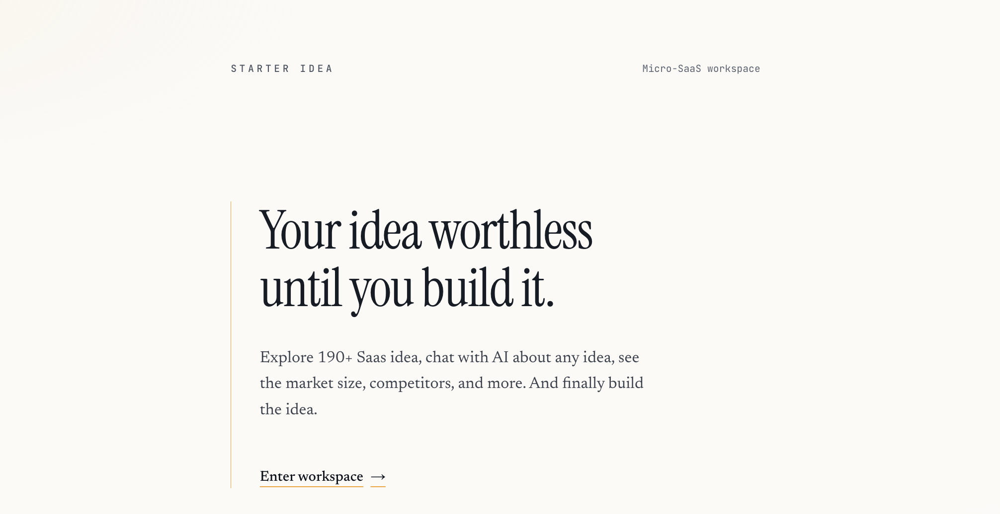

<p align="center">
  
</p>

# SaaS Ideas

`saas-ideas` is a Next.js app for collecting, validating, and prioritizing SaaS product ideas in one place.
It combines structured idea capture, lightweight market research, and AI-assisted exploration so solo
founders and small teams can move from "maybe" to "build this" faster.

## Project Overview

The project helps you:

- capture ideas with context (problem, audience, value proposition)
- validate assumptions before coding
- explore opportunities with AI chat and insights widgets
- track readiness from idea stage to launch planning

## Tech Stack

- Next.js (App Router) + React + TypeScript
- Tailwind CSS + Radix UI components
- Node-based API routes for chat and integrations
- Utility scripts for local data-source checks and agent tooling

## Project Structure

```txt
saas-ideas/
├── app/                    # Next.js routes, pages, and API endpoints
│   ├── api/                # Backend API routes (ideas, chat, GitHub, Product Hunt)
│   ├── dashboard/          # Main dashboard page
│   └── explore/            # Exploration experience
├── components/
│   ├── dashboard/          # Dashboard-specific UI and feature blocks
│   ├── prompt-kit/         # Chat and prompt experience components
│   └── ui/                 # Shared reusable UI components
├── lib/                    # Types, utilities, and domain helpers
├── hooks/                  # Reusable React hooks
├── public/                 # Static assets (icons, images, banner)
├── scripts/                # Local test and verification scripts
├── db/                     # Source data files (idea datasets, etc.)
└── README.md
```

## Project Setup

### 1) Prerequisites

- Node.js 20+ (recommended)
- pnpm (preferred package manager for this repo)

### 2) Install dependencies

```bash
pnpm install
```

### 3) Run the app locally

```bash
pnpm dev
```

The app starts on `http://127.0.0.1:3000`.

### 4) Useful commands

```bash
pnpm lint
pnpm build
pnpm start
pnpm test:agent-tooling
pnpm test:checkout-insights
pnpm test:overview-sources
```

## Roadmap

### Phase 1: Core Idea Workflow

- [x] Initial dashboard layout and idea exploration flow
- [x] API endpoints for idea listing, add, and validation
- [x] Basic chat-assisted ideation experience

### Phase 2: Validation and Insight Quality

- [ ] Improve idea scoring framework (problem urgency, market size, competition)
- [ ] Add stronger evidence capture (links, notes, user interview snippets)
- [ ] Enhance overview widgets with clearer validation signals

### Phase 3: Launch Readiness

- [ ] Build structured launch checklist templates per idea
- [ ] Add simple milestone tracking (research -> build -> launch)
- [ ] Export/share idea briefs for collaborators or advisors

### Phase 4: Collaboration and Scale

- [ ] Multi-user workspace support
- [ ] Permissions/roles for contributors
- [ ] Better external integrations (GitHub, Product Hunt, and future channels)

## Contributing

1. Create a feature branch
2. Make focused changes
3. Run `pnpm lint` and relevant test scripts
4. Open a pull request with a clear description

